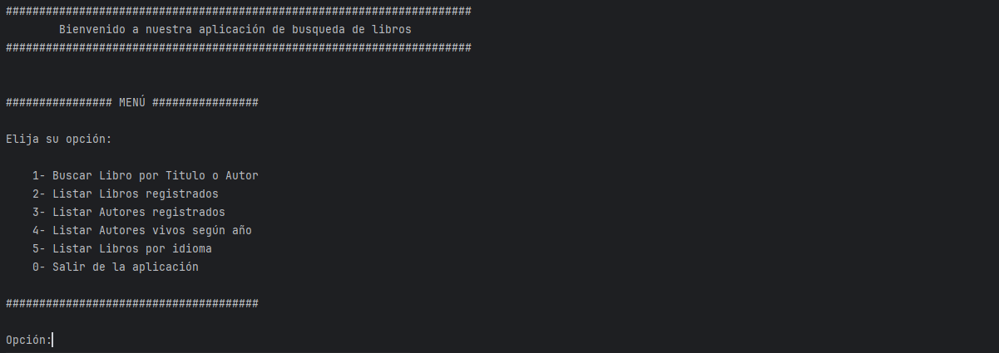
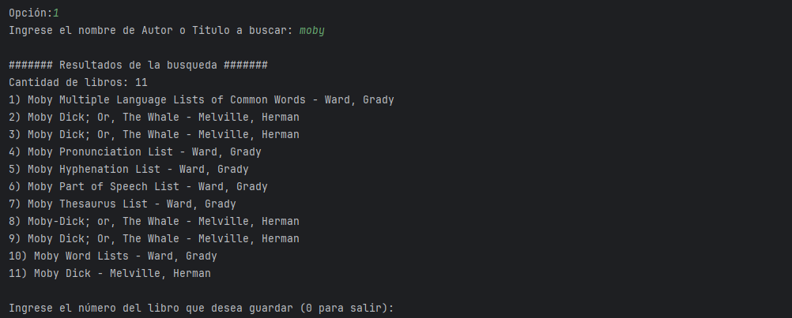
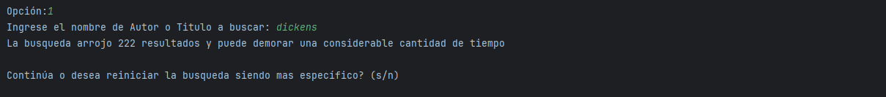
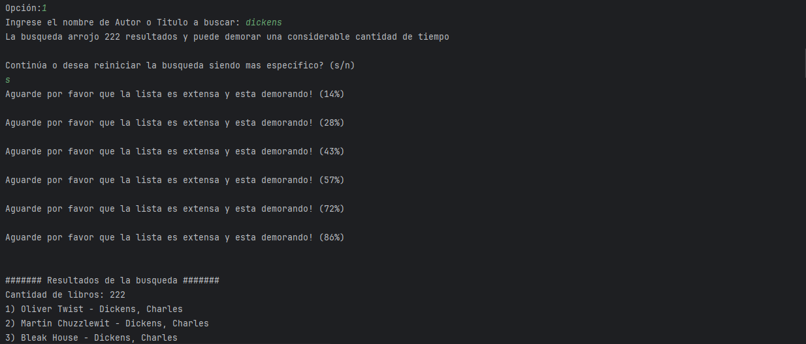
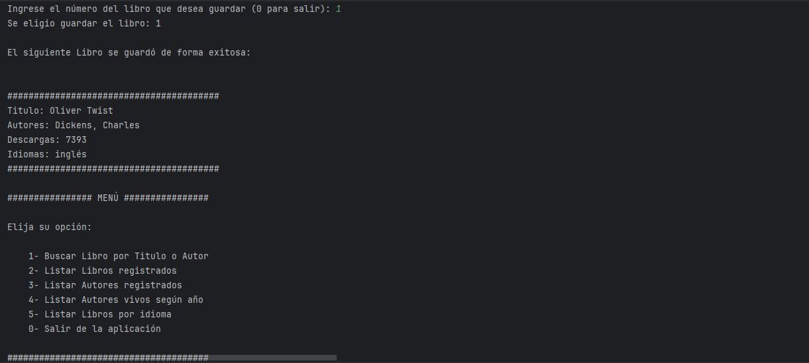

# Oracle One G6 - Challenge Literalura
<br>


<br><br>

### 1. Resumen del proyecto. [:arrow_right:](#Resumen-del-proyecto)
### 2. Guía de uso. [:arrow_right:](#Guía-de-uso)
### 3. Configuracion. [:arrow_right:](#Configuración)
### 4. Tratamiento de errores. [:arrow_right:](#Tratamiento-de-errores)
### 5. Licencia. [:arrow_right:](#Licencia)


  

<br><br><br>

----

<br>

## Resumen del proyecto
<br>

El presente documento, corresponde al Challenge LiterAlura correspondiente 
al curso Back-End "Java y Spring Boot G6 - ONE". 

Esta es una pequeña solución informática que mediante un menú de consola de 
comandos permite la búsqueda de libros en la API [GUTENDEX.](https://gutendex.com/)

Una vez seleccionado un libro este se guarda en una Base de Datos relacional 
para ser consultados tanto los datos de los Libros como de los Autores.

Fue diseñada y construida en lenguaje Java utilizando el Framework Spring y 
en particular Spring-Data para la gestión de la comunicación con la Base de Datos.

Volver al Menú [:arrow_up:](#Oracle-One-G6---Challenge-Literalura)

<br><br>

----

<br>

## Guía de uso

### Menú Principal

Al iniciar la aplicación se despliega un menú con las opciones disponibles.



#### Opción 1 - Buscar Libro por Titulo o Autor
Al ingresar un título o autor (o parte de éste) la aplicación buscará en la 
API [GUTENDEX](https://gutendex.com/) los resultados a listar. Luego imprimirá 
los mismos en pantalla numerados e indicando los titulos y primer autor de los mismos.

Luego de esto solicitará ingresar un número correspondiente a uno de los libros listados.



Si la consulta a la API arrojara mas de 25 resultados exibirá en pantalla un mensaje 
indicando esto y solicitará si se desea continuar o abortar la busqueda.



En caso de que se indique continuar irá mostrando un progreso de porcentaje a medida que 
recibe los resultados de la API ya que puede demorar un tiempo considerable si la cantidad de 
libros a listar es demasiado extensa.



Luego de ingresar el número correspondiente al libro que se desea guardar se imprimirá
en pantalla la confirmación de que fue guardado junto con la descripción del mismo.




Volver al Menú [:arrow_up:](#Oracle-One-G6---Challenge-Literalura)

<br><br>

----

<br>

## Configuración

Volver al Menú [:arrow_up:](#Oracle-One-G6---Challenge-Literalura)

<br><br>

----

<br>

## Tratamiento de errores

Volver al Menú [:arrow_up:](#Oracle-One-G6---Challenge-Literalura)

<br><br>

----

<br>

## Licencia

Volver al Menú [:arrow_up:](#Oracle-One-G6---Challenge-Literalura)

<br><br>


# Proyecto Integral N°2

El presente documento, es el **Proyecto Integral N°2** de ***Argentina Program 4.0***. Esta es una pequeña solución informática que sirve registrar los muebles de una mueblería.


#### Especificaciones
- Servidor: http://127.0.0.1:3005
- Autor: tu-nombre-y-apellido
- Versión: 1.0.8

#### Requerimientos
- Node.js v18.16.1
- MongoDB v5.6
- GIT v2.40.1
- IDE - Visual Studio Code v1.78.2

#### Estructura de directorios
``` tree
    ├── node_modules
    ├── src
    │   └── server.js
    ├── tests
    │   └── proyecto2.test.js
    ├── .env
    ├── .env.dist
    ├── .eslintrc.json
    ├── .gitignore
    ├── connection_db.js
    ├── package.json
    ├── package-lock.json 
    └── README.md
```

---
### CONFIGURACION DE ENTORNO
- #### VARIABLES DE ENTORNO
  Se debe hacer una copia del archivo **.env.dist** y renombrarlo como **.env**. Con respecto a su contenido, es necesario asignar los valores a correspondientes a las variables:
  ``` js
      SERVER_PORT=3005
      SERVER_HOST=127.0.0.1

      DATABASE_URL=tu-cadena-de-conexion
      DATABASE_NAME=muebleria
  ```

- #### TESTS
  Hasta el momento, hay una sola suite de test (proyecto2.test.js). La misma, se ejecuta por medio del comando ***npm run test***. Para que dicho test pase correctamente, se debe tener una base de datos en MongoDB llamada *muebleria* que tenga una collection denominada *muebles* y esta, contenga los documentos de los muebles. Además, se debe tener el servidor HTTP ejecutandose en otra terminal de Visual Studio Code. Esto se hace con ***npm run start***.

- #### ERRORES & FORMATOS
  La comprobación de errores y formatos se ejecuta por medio del comando ***npm run eslint***. se hace por medio de Eslint. Para visualizar los errores en tiempo de escritura, se debe tener instalada la extensión de **Eslint** en Visual Studio Code.

---
### MÓDULO DE MUEBLES

Este módulo permite la gestión de muebles. El mismo, ofrece funciones para agregar, modificar, borrar o leer el registro de un mueble. Además, permite visualizar reportes filtrados por diferentes criterios de búsqueda.

#### Métodos HTTP
| Tipo | URI | Descripción |
|------|-----|-------------|
| GET | http://127.0.0.1:3005/api/v1/muebles | Obtiene los registros (permite filtros) |
| GET | http://127.0.0.1:3005/api/v1/muebles/1 | Obtiene un registro en específico |
| POST | http://127.0.0.1:3005/api/v1/muebles | Crea un nuevo registro |
| PUT | http://127.0.0.1:3005/api/v1/muebles/1 | Modifica un registro en específico |
| DELETE | http://127.0.0.1:3005/api/v1/muebles/1 | Elimina un registro en específico |


#### Método GET:
- Request:
    - Parámetros opcionales de tipo QUERY:
        - categoria=Oficina  *(tipo: string. Trae los muebles de una misma categoría)*
        - precio_gte=500.00  *(tipo: decimal. Trae los muebles que tienen un precio mayor o igual a $500)*
        - precio_lte=400.00  *(tipo: decimal. Trae los muebles que tienen un precio menor o igual a $400)*
- Response:
    ``` json
        [
            {
                "_id": "64b082dabbbdbf35047fd6b6",
                "codigo": 7,
                "nombre": "Cama individual",
                "precio": 399.99,
                "categoria": "Dormitorio"
            }
        ]
    ```
    - Código HTTP: **200** *payload: muebles*
    - Código HTTP: **500** *message: Se ha generado un error en el servidor*


#### Método GET - Específico:
- Request:
    - Parámetro obligatorio de tipo URL:
        - 9 *(tipo: integer. Indica el código del mueble que se requiere obtener)*
- Response:
    ``` json
        {
              "_id": "64b082dabbbdbf35047fd6b7",
              "codigo": 9,
              "nombre": "Mesa de Comedor de Madera",
              "precio": 299.99,
              "categoria": "Comedor"
        }
    ```
    - Código HTTP: **200** *payload: mueble*
    - Código HTTP: **400** *message: El código no corresponde a un mueble registrado*
    - Código HTTP: **500** *message: Se ha generado un error en el servidor*


#### Método POST:
- Request:
    - Parámetros requeridos del BODY:
        - nombre=Biblioteca de madera deluxe *(tipo: string. Establece el valor del nombre)*
        - precio=1250.55                     *(tipo: integer. Establece el valor del precio)*
        - categoria=Oficina                  *(tipo: decimal. Establece el valor del categoría)*
- Response:
    - Código HTTP: **201** *message: 'Registro creado', payload: mueble*
    - Código HTTP: **400** *message: Faltan datos relevantes*
    - Código HTTP: **500** *message: Se ha generado un error en el servidor*
- Nota: *Los valores indicados en el ejemplo, son datos esperados en los tests.*


#### Método PUT:
- Request:
    - Parámetro obligatorio de tipo URL:
        - 16 *(tipo: integer. Indica el código del mueble que se requiere modificar)*
    - Parámetros requeridos del BODY:
        - nombre=Modular metálico deluxe *(tipo: string. Establece el valor del nombre)*
        - precio=999.75                  *(tipo: integer. Establece el valor del precio)*
        - categoria=Oficina              *(tipo: decimal. Establece el valor del categoría)*
- Response:
    - Código HTTP: **200** *message: 'Registro actualizado', payload: mueble*
    - Código HTTP: **400** *message: El código no corresponde a un mueble registrado*
    - Código HTTP: **400** *message: Faltan datos relevantes*
    - Código HTTP: **500** *message: Se ha generado un error en el servidor*
- Nota: *Los valores indicados en el ejemplo, son datos esperados en los tests.*


#### Método DELETE:
- Request:
    - Parámetro obligatorio de tipo URL:
        - 16 *(tipo: integer. Indica el código del mueble que se requiere eliminar)*
- Response:
    - Código HTTP: **200** *message: 'Registro eliminado'*
    - Código HTTP: **500** *message: Se ha generado un error en el servidor*
- Nota: *Los valores indicados en el ejemplo, son datos esperados en los tests.*