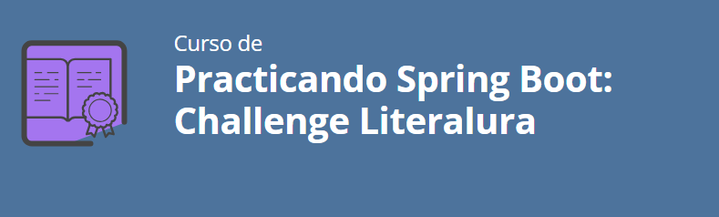

# Oracle One G6 - Challenge Literalura
 

  

### 1. Resumen del proyecto. [:arrow_right:](#Resumen-del-proyecto)
### 2. Guía de uso. [:arrow_right:](#Guía-de-uso)
### 3. Tratamiento de errores. [:arrow_right:](#Tratamiento-de-errores)
### 4. Licencia. [:arrow_right:](#Licencia)

  

   

----

 

## Resumen del proyecto
 

El presente documento, corresponde al Challenge LiterAlura del 
curso Back-End "Java y Spring Boot G6 - ONE". 

Esta es una pequeña solución informática que mediante un menú de consola de 
comandos permite la búsqueda de libros en la API [GUTENDEX.](https://gutendex.com/)

Una vez seleccionado un libro este se guarda en una Base de Datos relacional 
para ser consultados tanto los datos de los Libros como de los Autores.

Fue diseñada y construida en lenguaje Java utilizando el Framework Spring y 
en particular Spring-Data para la gestión de la comunicación con la Base de Datos.

La base de datos utilizada fue PostgreSQL.

Volver al Menú [:arrow_up:](#Oracle-One-G6---Challenge-Literalura)

  

----

 

## Guía de uso

### Menú Principal

##### [1- Buscar Libro por Título o Autor](#Buscar-Libro-por-Titulo-o-Autor)
##### [2- Listar Libros Registrados](#Listar-Libros-Registrados)
##### [3- Listar Autores Registrados](#Listar-Autores-Registrados)
##### [4- Listar Autores vivos según año](#Listar-Autores-por-año)
##### [5- Listar Libros por Idioma](#Listar-Libros-por-Idioma)
##### [0- Salir](#Salir)

Al iniciar la aplicación se despliega un menú con las opciones disponibles.

#### Buscar Libro por Titulo o Autor
Al ingresar un título o autor (o parte de éste) la aplicación buscará en la 
API [GUTENDEX](https://gutendex.com/) los resultados a listar. Luego imprimirá 
los mismos en pantalla numerados e indicando los titulos y primer autor de los mismos.

Luego de esto solicitará ingresar un número correspondiente a uno de los libros listados.

Si la consulta a la API arroja mas de 25 resultados exibirá en pantalla un mensaje 
indicando esto y solicitará si se desea continuar o abortar la busqueda.

En caso de que se indique continuar irá mostrando un progreso de porcentaje a medida que 
recibe los resultados de la API ya que puede demorar un tiempo considerable si la cantidad de 
libros a listar es demasiado extensa.

Luego de ingresar el número correspondiente al libro que se desea guardar se imprimirá
en pantalla la confirmación de que fue guardado junto con la descripción del mismo.

#### Listar Libros Registrados

Al elegir la opción 2 se muestra un listado de los libros registrados con el detalle de los mismos (Título / Autores / Cant. Descargas / Idiomas).

#### Listar Autores Registrados

Ingresando la opción 3 se muestra un listado de los autores con su detalle (Nombre / Año de Nacimiento 
/ Año de Fallecimiento / Libros ya registrados del Autor)

#### Listar Autores por año

En la opción 4 solicita el ingreso de una año (4 dígitos) y devuelve un listado de autores que se 
encontraban vivos en el año ingresado con sus respectivos detalles.

#### Listar Libros por Idioma

En esta opción solicita el ingreso de un idioma. Este puede ser ingresado en cualquier combinación de mayúsculas 
y minúsculas e incluso puede contener o no acentos). 

El idioma debe ser ingresado según con la configuración regional de la PC del usuario. 
Por ejemplo si la PC está configurada en español latino debería ingresar Inglés o ingles para buscar libros de 
este idioma. Si la PC está configurada con el dioma inglés para la misma búsqueda debería ingresar English o english.

#### Salir

Se muestra un salido en pantalla y finaliza la aplicación.

Volver al Menú [:arrow_up:](#Oracle-One-G6---Challenge-Literalura)

  

----

 

## Tratamiento de errores

Los posibles errores, tanto por ingreso incorrecto desde el teclado como por 
búsquedas que no arrojen resultados o resultados inválidos fueron tratados para 
evitar romper el flujo normal del programa.

Se muestran algunos ejemplos:

Errores de ingreso incorrecto en el menú principal
 
 

 
 
 
Evita duplicación de libro en Base de Datos
 

 
 
Informa si no se encontró coincidencias según lo ingresado en la búsqueda
 

 
 
Informa diferentes errores en el ingreso del año que se desea buscar autores
 

 
 

Volver al Menú [:arrow_up:](#Oracle-One-G6---Challenge-Literalura)

  

----

 

## Licencia

Licencia MIT

La licencia MIT fue la establecida al crear el repositorio en GitHub y está disponible 
para su lectura en el mismo repositorio a través de este [enlace](LICENSE).

Volver al Menú [:arrow_up:](#Oracle-One-G6---Challenge-Literalura)

  

